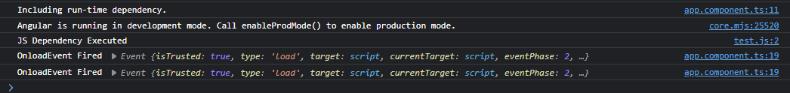

# Osano Test

This application tests the Osano privacy script's interactions with Angular 14.

## Scenario Setup

See [src/app.component.ts](./src/app/app.component.ts) for test code. It adds a script tag to the DOM at run-time, marked for async loading.

*app.component.ts*
```TypeScript
console.log("Including run-time dependency.");

var o = document.createElement("script");
o.async = true;
o.src = 'assets/test.js';
o.onload = function(event)
{
    // Should only be fired once.
    console.log("OnloadEvent Fired", event);
};
document.querySelector("head")!.appendChild(o);
```

Open the browser console to see the output:


## Running Locally

Run `ng serve` for a dev server. Navigate to `http://localhost:4200/`. The application will automatically reload if you change any of the source files.

## Build

Run `ng build` to build the project. The build artifacts will be stored in the `dist/` directory.
